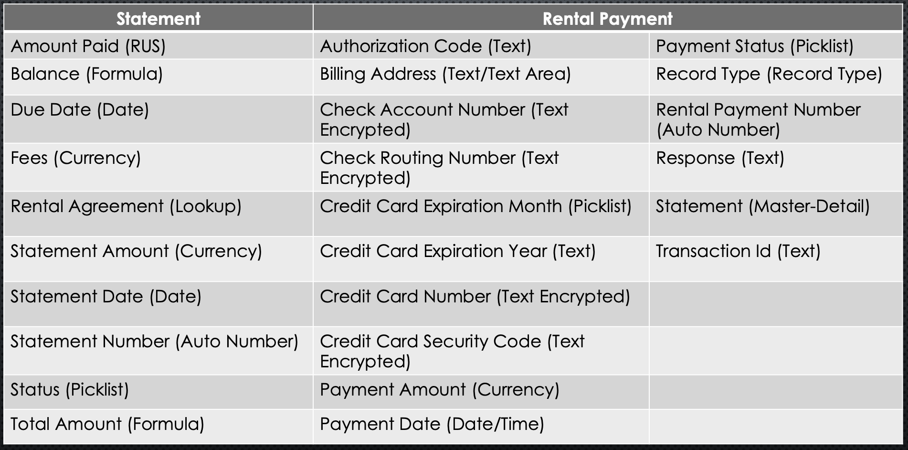

# Salesforce-Property-Management-App

### Video Overview
[

### Requirements

- The ability to track work items for a specific property and its status
- Track tenants for each apartment for a specific property and rental payments

### Schema

### Custom Fields

### Custom App

- New custom app (property management)
- Objects: properties, rental units, tenants, rental agreements, statements, rental payments, cases

### Validation Rules

Rental agreement:
- Prevent selecting pets if rental unit is not pet friendly
- Prevent adding a pet deposit if pets is not checked
- Prevent lease end date from being before start date

Rental Payment:
- Prevent submitting a payment which is more than the statement balance
- Payment must be greater than zero

### Lookup Filters

Rental agreement:
- Prevent selecting a rental unit whose status isn't available to rent (Optional)
- Prevent selecting a tenant that does not have a passing credit or background check

### Custom Metadata

- Custom metadata to store Authorize.net API keys

### Remote Site Settings

- Add URL to authorize making a callout/request to endpoint

### Static Resource

- Rental agreement terms and conditions placeholder

### Experience Cloud

- Portal for tenants to search properties, create rental agreements, pay statements, and create cases
- Tenant dashboard (Visualforce), properties, rental units, statements with payment portal (LWC), tenant application LWC, rental agreement LWC, request center

### Tenant Dashboard Visualforce Page

- Portal for tenants to search properties, create rental agreements, pay statements, and create cases
- Tenant dashboard (Visualforce), properties, rental units, statements with payment portal (LWC), tenant application LWC, rental agreement LWC, request center

### Prospective Tenant Dashboard

- Page providing explanation on how to create rental agreement or open a case

### Rental Agreement Creation LWC

- Search properties/rental units based on preferences
- Gather missing tenant information
- Create rental agreement

### Payment Portal LWC

- Displayed fields based on payment method selection
- HTML form input sent to controller for processing
- Controller puts together request to send to Authorize.net integration method

### Authorize.net Integration

- Retrieving API keys from custom metadata
- Authorizing with Authorize.Net
- Build message to send to Authorize.net for payment processing
- Save output
- Wrapper classes for request and response

### Support Center/Service Requests

- Standard component to create case with action layout edited to include desired fields

### Triggers

Rental Agreement:
- Change rental unit status to pending when rental agreement is created
- Prevent creating a new agreement with a tenant with an outstanding balance on other agreements (Inactive)

Statement:
- Change rental unit status to rented when statement status is changed to paid
- Rollup total invoiced amount to rental agreement

Rental Payment:
- Rollup total payments amount to rental agreement

Cases:
- Update Maintenance checkbox to true if a new case is created for a unit with a status not closed. Update to false once all cases related to the unit are closed

Tenant:
- Add Default credit and background check

User:
- Add Community User permission set

### Improvements

- Change statement status based on payment
- Create a new statement every month for the agreement while active
- Automation to implement credit and background checks for tenant
- Add email reminders for payment due and overdue
- Add logic to allow fees for pets in rental agreement creation
- More custom logic to choose lease start date
- Upload actual rental agreement into static resources
- Bulkify test classes
- Use named credentials instead of custom metadata for API credentials
- Control when tenant can edit statement
- Perform security audit
